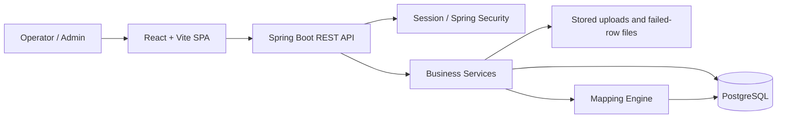
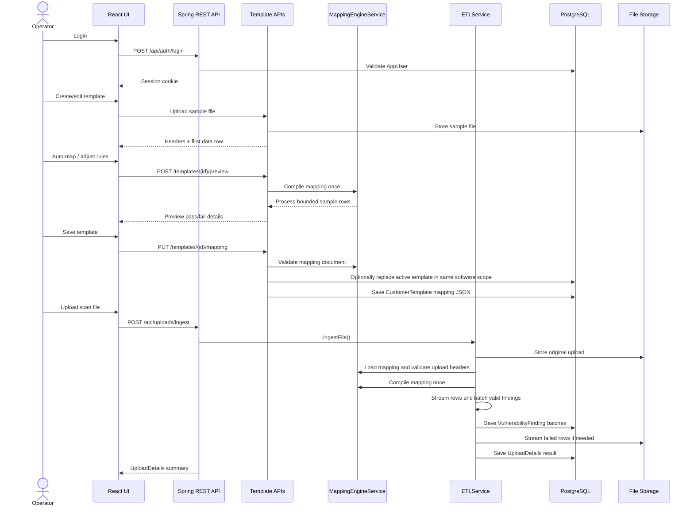
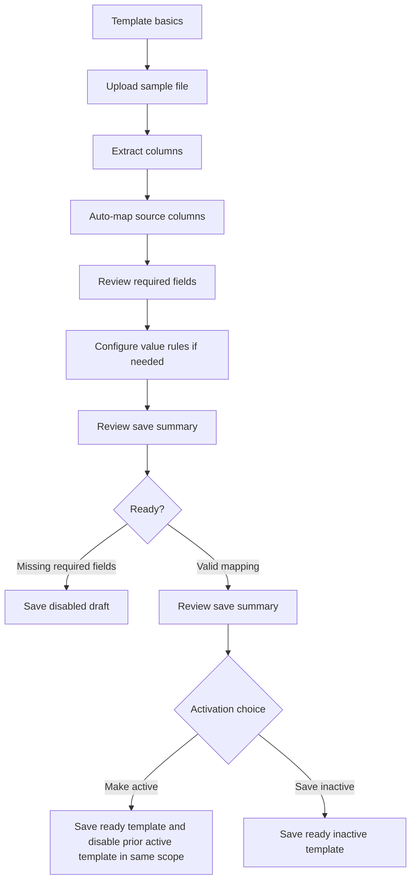
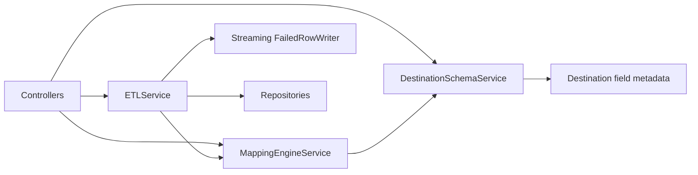
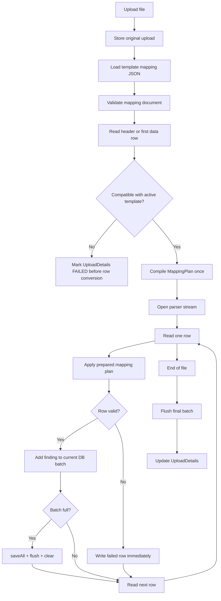
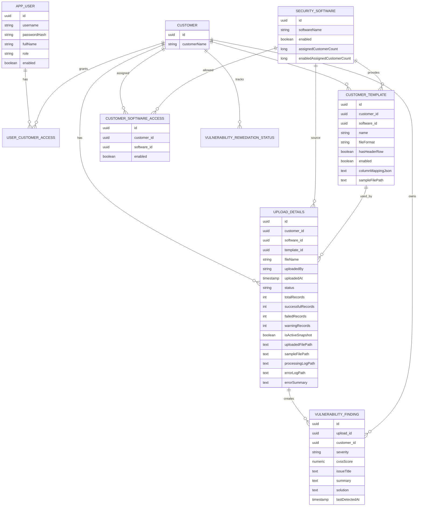
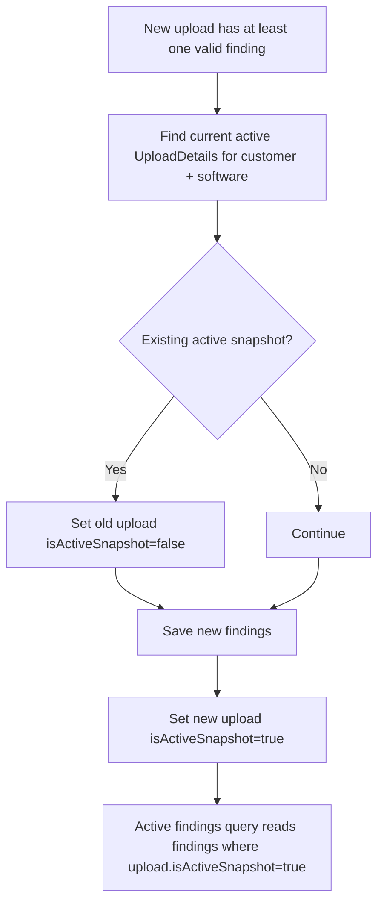

# SecVulManager Architecture And Ingestion Flow

This document explains how SecVulManager is organized, how the vulnerability ingestion flow works, how the mapper UI and backend mapping engine interact, how database state is maintained, and where developers can extend the system safely.

## 1. Product Scope

SecVulManager supports vulnerability import, normalization, remediation tracking, and administration.

Main capabilities:

- User login and session-based access.
- Customer management.
- Security software vendor management.
- Global and customer-specific import templates.
- Sample file extraction and column mapping.
- Backend-powered mapping preview.
- Large-file vulnerability ingestion.
- Upload history and failed-row download.
- Active finding review.
- Remediation workflow tracking.
- User and customer access administration.

## 2. High-Level System



Technology layout:

- Frontend: `frontend/src/App.jsx`, `frontend/src/api.js`
- Backend controllers: `backend/src/main/java/com/secvulmanager/api/controller/`
- Backend services: `backend/src/main/java/com/secvulmanager/api/service/`
- Backend models/entities: `backend/src/main/java/com/secvulmanager/api/model/`
- Backend repositories: `backend/src/main/java/com/secvulmanager/api/repository/`
- Configuration: `backend/src/main/resources/application.properties`

## 3. Primary User Flow



## 4. Frontend Responsibilities

The frontend is a single-page React application centered in `frontend/src/App.jsx`.

Important frontend responsibilities:

- Load session status and route the user to available management areas.
- Render searchable/filterable list pages.
- Open item details as full pages/workspaces, not modals or right-side panels.
- Manage global customer scope in the shell header.
- Create and edit software vendors, customers, users, and templates.
- Upload template sample files.
- Display source columns, destination schema, mapping status, and backend preview results.
- Upload vulnerability scan files for ingestion.
- Show active vulnerability records and upload history as separate filtered tabs.
- Sort vendor/software choices by latest upload time so the newest upload is easiest to review.

API calls should go through `frontend/src/api.js`. Components should not call `fetch` directly.

### Template Mapper UI Flow



Current mapper capabilities:

- Extract headers from CSV, TSV, PSV, XLS, and XLSX sample files.
- For no-header files, generate `Column_0`, `Column_1`, etc.
- Preserve one first data row for preview.
- Auto-map by source header matching, aliases, partial matching, and token overlap.
- Show required destination fields.
- Configure transformations:
  - `TRIM`
  - `TO_UPPER`
  - `TO_LOWER`
  - `REMOVESPACES`
- Configure default value and force value.
- Configure conversion:
  - `NONE`
  - `TO_STRING`
  - `TO_NUMBER`
  - `TO_DATE`
  - `TO_BOOLEAN`
- Configure conversion failure mode:
  - `FAIL_ROW`
  - `SET_NULL`
  - `SET_EMPTY`
  - `SET_CUSTOM`
- Backend sample preview code exists for phase 2, but the current wizard allows saving without running that step.
- Save a ready template as active or inactive.
- Save a disabled draft.
- When saving as active, confirm whether it replaces the existing active template in the same software scope.

## 5. Backend API Areas

Main REST areas:

- `/api/auth`: login, logout, current session.
- `/api/customers`: customer CRUD.
- `/api/software`: security software CRUD and enable/disable.
- `/api/templates`: template list, schema, update, mapping save, preview, sample upload, sample download.
- `/api/uploads`: vulnerability file ingestion, upload history, failed-row download, original upload download.
- `/api/vulnerabilities`: active findings with customer/software/template filters and manual endpoints.
- `/api/vulnerabilities/remediation`: remediation workflow read/update.
- `/api/users`: user administration and customer access.

Template-specific endpoints:

```text
GET  /api/templates/schema
POST /api/templates/{id}/sample
POST /api/templates/{id}/preview
PUT  /api/templates/{id}/mapping
PUT  /api/templates/{id}
GET  /api/templates/{id}/sample
```

Upload-specific endpoints:

```text
POST /api/uploads/ingest
GET  /api/uploads
GET  /api/uploads?customerId=&softwareId=&templateId=&status=&activeSnapshot=
GET  /api/uploads/{id}/error-log
GET  /api/uploads/{id}/sample
```

## 6. Backend Service Responsibilities



### `ETLService`

`ETLService` owns the upload ingestion lifecycle.

Responsibilities:

- Resolve customer and template.
- Create `UploadDetails`.
- Store the original uploaded scan file.
- Load mapping configuration.
- Validate the uploaded file headers against the active template before row conversion.
- Stream supported input rows.
- Compile mapping once per upload.
- Process each row through `MappingEngineService`.
- Batch valid findings into PostgreSQL.
- Stream failed rows to a downloadable error file.
- Update upload counts and status.
- Mark the successful upload as the active snapshot for the customer + software.

`ETLService` should not contain field-level mapping business rules. It should orchestrate ingestion and performance-sensitive batching.

### `MappingEngineService`

`MappingEngineService` owns mapping validation and field-level row processing.

Responsibilities:

- Parse saved template mapping JSON.
- Validate mapping metadata.
- Validate destination fields against backend schema.
- Validate transform names.
- Validate header compatibility before ingestion starts.
- Compile `Map<String,Object>` mapping rows into a `MappingPlan`.
- Resolve source column indexes once.
- Store prepared conversions and field metadata in lightweight records.
- Apply mapping rules to one row.
- Bind converted values into `VulnerabilityFinding`.
- Return row-level success/failure details.
- Return field-level preview details for sample preview.

Important performance rule:

```text
JSON parsing, validation, header lookup, and mapping normalization happen once.
The row loop uses only prepared mappings and direct array access.
```

### `DestinationSchemaService`

`DestinationSchemaService` is the backend source of truth for mappable destination fields.

Responsibilities:

- Define destination field name.
- Define UI label.
- Define target type.
- Define required/nullable rules.
- Feed `GET /api/templates/schema`.
- Feed backend mapping validation.

Frontend can still keep fallback schema constants, but the backend schema should be preferred.

## 7. Optimized Ingestion Pipeline

The canonical field pipeline is:

```text
extract source value
  -> clean/transform
  -> default or force value handling
  -> type conversion
  -> conversion failure policy
  -> destination validation
  -> bind to VulnerabilityFinding
```

Large-file processing pipeline:



Performance optimizations already applied:

- CSV/TSV/PSV rows are streamed using the parser iterator.
- The system no longer uses `parser.getRecords()` for ingestion or sample extraction.
- Mapping configuration is parsed and compiled once.
- Header-to-index lookup is done once.
- Header compatibility is checked before row conversion, so wrong vendor files fail early instead of producing row-by-row conversion failures.
- Each row uses direct `String[]` source access.
- Valid findings are persisted in batches.
- Hibernate persistence context is flushed and cleared after each batch.
- Failed rows are streamed to CSV/XLSX instead of held in memory.
- XLSX failed-row output uses `SXSSFWorkbook`.
- SQL debug and binder trace logging are disabled by default.
- Hibernate JDBC batching is enabled.
- Integer conversion rejects decimals instead of silently truncating.

Configurable performance properties:

```properties
spring.jpa.properties.hibernate.jdbc.batch_size=500
spring.jpa.properties.hibernate.order_inserts=true
spring.jpa.properties.hibernate.order_updates=true
secvulmanager.ingestion.batch-size=500
```

## 8. Why More Services Do Not Slow Ingestion

The backend uses services for separation of responsibilities, but not as a per-cell Spring call chain.

Avoid this pattern:

```text
for each row:
  for each field:
    call transformation service
    call conversion service
    call validation service
    call repository
```

Current optimized pattern:

```text
before row loop:
  parse JSON once
  validate once
  compile MappingPlan once

inside row loop:
  process row with prepared mappings
  append valid finding to batch
  stream failed row immediately
```

This gives better code organization without adding repeated expensive setup work.

## 9. Database Model

Core database entities:



### Active Snapshot Logic

Each successful or partially successful upload can become the active snapshot for a customer + software pair.

This lets one customer keep independent current vulnerability sets for multiple vendors. For example, the latest Nessus upload and latest Kaseya upload can both be active for the same customer.



Current active findings query:

```text
VulnerabilityFinding where customer.id = :customerId
and upload.isActiveSnapshot = true
and optional upload.software.id = :softwareId
and optional upload.template.id = :templateId
```

This keeps historical uploads available while making the current finding set easy to query.

Upload history remains complete and is sorted by `uploadedAt DESC`. It can be filtered by customer, software, template, upload status, and active/historical snapshot state.

### Template Activation Rule

Only one active template is allowed per software scope:

- Global scope: one active global template per software.
- Customer scope: one active customer template per customer + software.

When saving a ready template, the UI asks whether to make it active or save it inactive. New inactive templates are created with `is_enabled=false` immediately. If the user chooses active and another active template exists in the same scope, the existing active template is disabled only when the save request explicitly includes the replacement flag. Draft templates are saved inactive and do not replace active templates.

`SecuritySoftware.assignedCustomerCount` and `SecuritySoftware.enabledAssignedCustomerCount` are transient API summary fields calculated from `customer_software_access`; they are not physical `security_software` columns.

## 10. Template Mapping JSON

Saved templates use a mapping document shape like:

```json
{
  "metadata": {
    "version": 1,
    "status": "ready",
    "savedAt": "2026-05-25T00:00:00.000Z",
    "ignoredSourceColumns": ["Vendor Column"],
    "requiredDestinationFieldsMissing": [],
    "optionalDestinationFieldsMissing": []
  },
  "mappings": [
    {
      "sourceColumnIndex": 0,
      "sourceColumnName": "Plugin Name",
      "sourceDataType": "STRING",
      "targetFieldName": "issue_title",
      "targetDataType": "STRING",
      "transformations": [{ "action": "TRIM" }],
      "defaultValue": "",
      "forceValue": "",
      "conversionType": "NONE",
      "conversionErrorMode": "FAIL_ROW",
      "conversionErrorValue": "",
      "isNullable": false
    }
  ]
}
```

Important semantics:

- `defaultValue`: used only when the source value is blank.
- `forceValue`: always overrides the source value.
- `conversionErrorMode`: applies only when conversion fails.
- `SET_NULL`: should be treated as a failure/empty output policy, not a normal transform.
- `status=ready`: ingestion can use the template.
- `status=draft`: template is saved but disabled for ingestion.
- Header-based ready templates require uploaded files to contain all mapped source columns before row conversion starts.
- No-header templates validate that the first data row has enough source columns before row conversion starts.

## 11. Upload Status And Failed Rows

Upload statuses:

- `PROCESSING`: upload has started.
- `SUCCESS`: every row was ingested.
- `PARTIAL_FAILURE`: at least one row succeeded and at least one failed.
- `FAILED`: no rows succeeded or the upload could not be parsed/processed.

Failed row handling:

- Failed rows are not stored in memory.
- Failed rows are written to a generated file as they occur.
- Delimited uploads produce CSV failed-row files.
- Spreadsheet uploads produce XLSX failed-row files.
- `UploadDetails.errorLogPath` stores the downloadable failed-row file path.
- If template/header compatibility fails, no failed-row file is created because row conversion never starts; the reason is stored in `UploadDetails.errorSummary`.

Upload statistics:

- `totalRecords`: data rows read from the file.
- `successfulRecords`: normalized findings inserted.
- `failedRecords`: rows written to the failed-row file.
- `warningRecords`: reserved for non-blocking row warnings.

Active replacement rules:

- `FAILED` uploads never replace the active snapshot.
- `SUCCESS` uploads replace the current active snapshot for the same customer + software.
- `PARTIAL_FAILURE` uploads replace the active snapshot only when at least 50% of rows succeeded.
- `PARTIAL_FAILURE` uploads below 50% success stay historical by default. A user can review the upload detail page and manually mark it active if it should replace the previous active snapshot.
- Active Vulnerabilities defaults only consider active `SUCCESS` or `PARTIAL_FAILURE` snapshots with successful rows. Failed and historical uploads never drive the default vendor/software filter.

Generated-file handling:

- Local files under `backend/uploads/`, `backend/scan-uploads/`, and `backend/failed-uploads/` are runtime artifacts and are ignored by git.
- Product export files should be implemented as tracked export jobs with metadata such as export job id, requesting user, filter/list scope, timestamp, status, and downloadable file path. They should not be committed as repository source files.

## 12. Developer Extension Guide

### Frontend Developer

Use these extension points:

- Add API methods to `frontend/src/api.js`.
- Keep template editing inside the full-page workspace.
- Use backend schema from `GET /api/templates/schema`.
- Use backend preview before saving complex mapping changes.
- Keep confirmation flows using themed in-app confirmation components.
- Avoid browser-native `alert`, `confirm`, or `prompt`.

When adding mapper controls:

- Update the mapping payload shape in `toMappingPayload`.
- Update frontend preview for fast local feedback if useful.
- Update backend `MappingEngineService` so backend preview and ingestion match.

### Backend Developer

Use these extension points:

- Add destination fields in `DestinationSchemaService`.
- Add mapping behavior in `MappingEngineService`.
- Keep `ETLService` focused on streaming, batching, upload lifecycle, and persistence.
- Avoid adding repository calls inside the row loop.
- Avoid parsing JSON inside the row loop.
- Avoid repeated header scans inside the row loop.

When adding conversion behavior:

- Validate the mapping document first.
- Compile conversion behavior into `MappingPlan`.
- Use the same engine for preview and ingestion.

### Database Developer

Important database considerations:

- `UploadDetails` is the ingestion run table.
- `VulnerabilityFinding` is append-only per upload run.
- Active findings are selected through the active upload snapshot per customer + software.
- Historical upload runs remain queryable.
- Failed-row details are file-backed, not stored row-by-row in the database.
- `upload_details.software_id` is stored directly for stable filtering/backtracking even if template metadata changes later.
- `uploaded_file_path` is the original scan upload path. `sample_file_path` exists for backward compatibility with earlier builds.

Useful indexes to consider as volume grows:

```sql
CREATE INDEX IF NOT EXISTS idx_upload_details_customer_software_active
ON upload_details (customer_id, software_id, is_active_snapshot);

CREATE INDEX IF NOT EXISTS idx_vulnerability_finding_customer_upload
ON vulnerability_finding (customer_id, upload_id);

CREATE INDEX IF NOT EXISTS idx_upload_details_customer_uploaded_at
ON upload_details (customer_id, uploaded_at DESC);

CREATE INDEX IF NOT EXISTS idx_customer_template_customer_software
ON customer_template (customer_id, software_id);
```

## 13. Current Limitations And Future Improvements

Current limitation:

- CSV/TSV/PSV ingestion is optimized for large files.
- XLS/XLSX ingestion still uses Apache POI `WorkbookFactory`, which loads workbook structures in memory.
- This is acceptable for the current configured 50MB upload limit.

Future improvement for very large spreadsheets:

- Use Apache POI event/SAX parsing for `.xlsx`.
- Keep `WorkbookFactory` only for smaller files or template sample extraction.
- Add asynchronous upload jobs if ingestion needs to continue after HTTP request timeout limits.
- Add progress polling for long-running uploads.
- Generate and expose `processingLogPath` files for detailed upload lifecycle logs.
- Add field-level warning summaries to `UploadDetails`.

## 14. Benefits Of The Current Design

Operational benefits:

- Operators can test mapping behavior before ingestion.
- Preview and real ingestion use the same backend engine.
- Upload failures produce downloadable failed-row files.
- Active findings remain isolated from historical uploads.
- Active findings remain independently current per customer + software.

Performance benefits:

- Large delimited files are streamed.
- Mapping setup happens once per upload.
- Row processing uses prepared mappings.
- DB writes are batched.
- Failed-row output is streamed.
- Hibernate memory pressure is reduced with flush/clear.
- SQL debug logging no longer dominates ingestion runtime.

Developer benefits:

- Frontend schema and backend validation are aligned.
- Mapping logic is centralized in `MappingEngineService`.
- Ingestion orchestration is isolated in `ETLService`.
- Database ownership is clear through JPA entities and repositories.
- Future mapper improvements can be added without rewriting the ingest loop.
